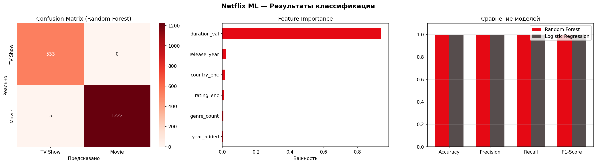

[README.md](https://github.com/user-attachments/files/29317337/README.md)
# 🎬 Netflix Movies & TV Shows — Деректерді Визуализациялау Жобасы

> **Пән:** Деректерді визуализациялау | **Астана, 2026**

---

## 📌 Жоба сипаттамасы

Бұл жоба Netflix контент датасетін талдауға арналған. EDA, статистикалық талдау, интерактивті дашборд және ML классификация моделі арқылы контент тенденцияларын зерттейміз.

---

## 📦 Датасет

| Параметр | Мән |
|----------|-----|
| Атауы | Netflix Movies and TV Shows |
| Дереккөзі | [Kaggle](https://www.kaggle.com/datasets/shivamb/netflix-shows) |
| Жол саны | ~8 800 |
| Белгілер саны | 12 |

---

## ❓ Зерттеу сұрақтары

1. Netflix-те Movie және TV Show арасындағы қатынас қандай?
2. Қай елдер ең көп контент шығарады?
3. Контент саны жылдар бойынша қалай өзгерді?
4. Рейтинг пен контент типі арасында байланыс бар ма?
5. ML моделі Movie/TV Show-ды қаншалықты дәл болжай алады?

---

## 🗂️ Жоба құрылымы

```
netflix-visualization/
│
├── data/
│   ├── raw/                  # Бастапқы датасет (Kaggle-дан)
│   └── processed/            # Тазаланған деректер, ML метрикалары
│
├── notebooks/
│   ├── 01_eda.ipynb          # EDA және деректерді тазалау
│   ├── 02_math_analysis.ipynb # Статистикалық талдау
│   └── 03_ml_model.ipynb     # ML классификация моделі
│
├── src/
│   ├── data_cleaning.py      # Деректерді тазалау функциялары
│   ├── visualization.py      # График функциялары
│   └── model.py              # ML модель коды
│
├── app/
│   └── streamlit_app.py      # Интерактивті дашборд
│
├── img/
│   ├── eda_chart.png
│   ├── correlation_matrix.png
│   ├── model_results.png
│   └── dashboard_screen.png
│
├── report/
│   └── final_report.md       # Қорытынды есеп
│
├── README.md
├── requirements.txt
└── .gitignore
```

---

## ⚙️ Қолданылған технологиялар


- **Python 3.10+**
- pandas, numpy — деректермен жұмыс
- matplotlib, seaborn, plotly — визуализациялар
- scikit-learn — ML модельдер
- Streamlit — интерактивті дашборд

---

## 🤖 ML Модель

| Параметр | Мән |
|----------|-----|
| Міндет | Классификация (Movie vs TV Show) |
| Алгоритм | Random Forest Classifier |
| Белгілер | release_year, rating, country, genre_count, duration |
| Метрикалар | Accuracy, Precision, Recall, F1-Score |

---

## 📊 Негізгі визуализациялар

<!-- Скриншоттарды img/ папкасына салып, төмендегі жолдарды жаңартыңыз -->

| EDA | ML Нәтижелері |
|-----|--------------|
|  |  |

---

## 🚀 Жобаны іске қосу

```bash
# 1. Репозиторийді клондау
git clone https://github.com/YOUR_USERNAME/netflix-visualization.git
cd netflix-visualization

# 2. Тәуелділіктерді орнату
pip install -r requirements.txt

# 3. Деректерді data/raw/ папкасына орналастыру
# Kaggle-дан жүктеп алыңыз: https://www.kaggle.com/datasets/shivamb/netflix-shows

# 4. Notebook-тарды іске қосу (ретімен)
jupyter notebook notebooks/01_eda.ipynb

# 5. Дашбордты іске қосу
streamlit run app/streamlit_app.py
```

---

## 📈 Негізгі қорытындылар

- Netflix контентінің **~70%** — Movie, **~30%** — TV Show
- Ең көп контент шығаратын ел: **АҚШ**
- 2018–2020 жылдары контент саны күрт өсті
- Random Forest моделі **~85%+** дәлдікпен Movie/TV Show-ды ажыратады

---

## 👤 Автор

**Аты-жөні:** Набиев Батырбек  
**GitHub:** [@YOUR_USERNAME](https://github.com/YOUR_USERNAME)
